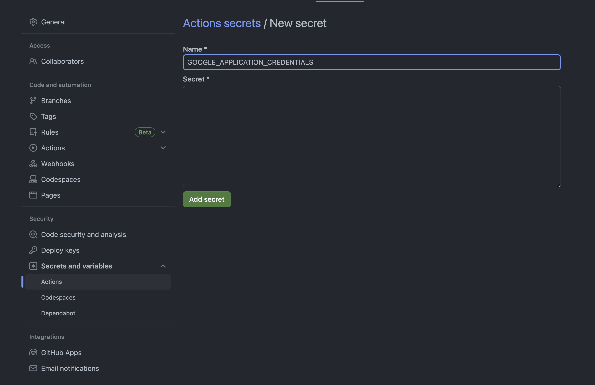
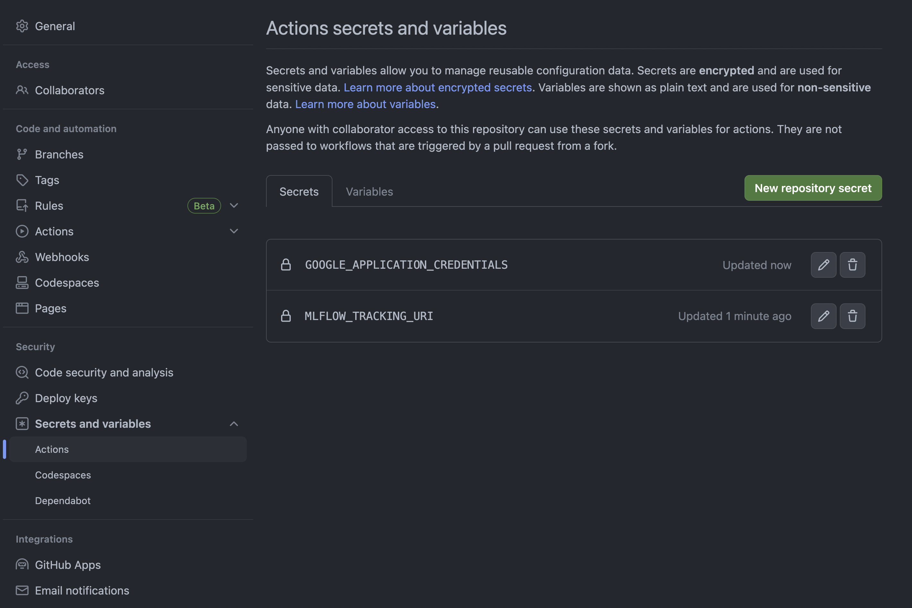

# CI/CD Workflow with CML

## What is CI/CD?

A good article about CI/CD from [github](https://resources.github.com/ci-cd/):

Automation is a core principle for achieving DevOps/MLOps success and CI/CD is a critical component. CI/CD comprises of continuous integration and continuous delivery or continuous deployment. Put together, they form a “CI/CD pipeline”—a series of automated workflows that help DevOps teams cut down on manual tasks:

- Continuous integration (CI) automatically builds, tests, and integrates code changes within a shared repository; then
- Continuous delivery (CD) automatically delivers code changes to production-ready environments for approval; or
- Continuous deployment (CD) automatically deploys code changes to customers directly.

When someone says CI/CD, the “CD” they’re referring to is usually continuous delivery, not continuous deployment. What’s the difference? In a CI/CD pipeline that uses continuous delivery, automation pauses when developers push to production. A human—your operations, security, or compliance team—still needs to manually sign off before final release, adding more delays. On the other hand, continuous deployment automates the entire release process. Code changes are deployed to customers as soon as they pass all the required tests.

## CI/CD in Machine Learning

In machine learning, the CI/CD pipeline is a bit different from the traditional software development pipeline. The main difference is that the CI/CD pipeline for machine learning is not only about code, but also about data. In the traditional software development pipeline, the code is the only thing that changes. In the machine learning pipeline, the data is also changing. The data is the input to the machine learning model, and the model is trained on the data. Therefore, the data is also a part of the CI/CD pipeline.

For example because you are tracking your model performance (topics of the following days) that your model performance is changing over time. Therefore, you need to retrain your model with the new data. With CML, you can automate this process.

## CI/CD with CML

CML is a CI/CD open-source library for machine learning. It is built on top of GitHub Actions and allows you to automate your machine learning workflows. It is developed by [iterative.ai](https://iterative.ai/). 

Let's get started:

In `train.py` we are training a `XGBoost Regressor` on the Green Taxi Trip dataset. We are tracking the experiment with `mlflow`, registering the model and changing its stage to `Staging`. 

Also we added `argparse`to our code which allows us to pass the argument `--cml-run` or `--no-cml-run` to our code. If we pass `--cml-run` to our code, it will export the metrics as a txt file and also saves a residual plot which is created with Yellowbricks. This can be added to the `cml report`.

Now we will create a `cml.yaml` file as a github workflow. This file will be used by CML to run our code. We run our `train.py` with the --cml-run argument and export a report with cml.
With this workflow we are training the model on the github server but there are also ways to train the model on a cloud service like AWS or GCP with [cml-runners](https://cml.dev/doc/self-hosted-runners) but this is not covered in this course. If you want to train bigger models you should investigate this option.

Also we will add DVC to load the data from the DVC remote so the GCS bucket. This will help us to automatically train the model updated data.

This workflow will be triggered when we open a pull request to the main branch. This is a good practice because we want to make sure that our code is working before we merge it to the main branch.

```yaml
name: CML
on: 
    pull_request:
        branches: 
            - main
jobs:
  train-and-report:
    runs-on: ubuntu-latest
    steps:
      - uses: actions/checkout@v3
      - uses: iterative/setup-cml@v1
      - name: Train model
        env:
          GOOGLE_APPLICATION_CREDENTIALS: ${{ secrets.GOOGLE_APPLICATION_CREDENTIALS }}
          MLFLOW_TRACKING_URI: ${{ secrets.MLFLOW_TRACKING_URI }}
          REPO_TOKEN: ${{ secrets.GITHUB_TOKEN }}
        run: |
          echo "$GOOGLE_APPLICATION_CREDENTIALS" | base64 --decode | jq > credentials.json
          pip install -r requirements.txt
          echo "Pulling data from GCS..."
          dvc remote modify --local myremote \
                    credentialpath './credentials.json'
          dvc pull
          echo "Training model..."
          python src/train.py --cml_run
          cat metrics.txt >> report.md
          cml comment create report.md 
          rm credentials.json
```

But you also see in this workflow that there are environment variables. These are stored in the `secrets` of your github repository. You can add these secrets by going to your repository and clicking on `Settings` and then `Secrets`. Here you can add your secrets. In this case we need the `GOOGLE_APPLICATION_CREDENTIALS` to access our GCP bucket and the `MLFLOW_TRACKING_URI` to track our experiment with mlflow.

For the `Google Application Credentials` you can use the one we created in the previous markdown. Copy/pasting the content of a JSON is not recommended because it can cause formatting issues. Instead, you can encode the JSON file as a base64 string and paste the result in the secret value field. You can use the following command to encode the JSON file:

```bash
cat <path-to-json-file> | base64 | pbcopy
```

The pipe operator (|) sends the output of the cat command to the base64 command, which encodes it as a base64 string. The pbcopy command copies the result to your clipboard. You can then paste the result in the secret value field. During the GitHub Actions workflow, the string is than decoded and writen to a file again as you can see in the first run step of the workflow.



For the `MLFLOW_TRACKING_URI` you need to create a new secret and add the tracking uri of your mlflow server. In this case we are using the mlflow server from the previous day so start it up again and copy the tracking uri.


